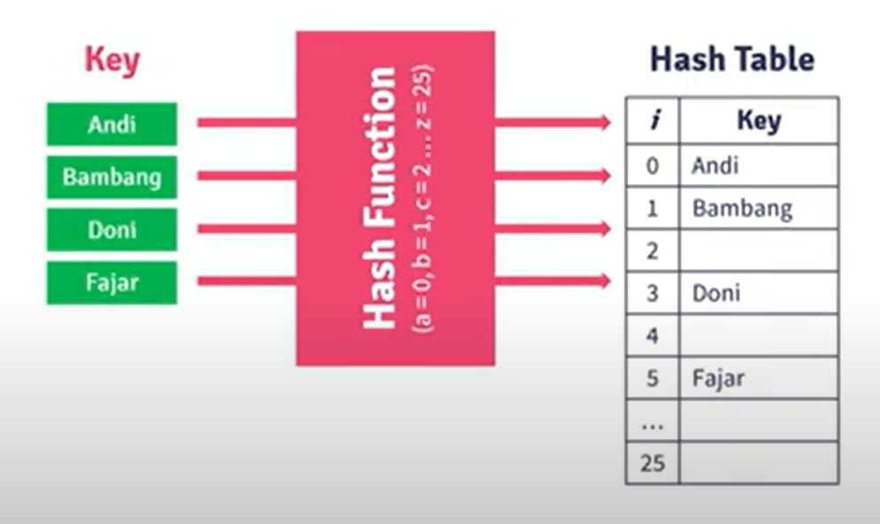
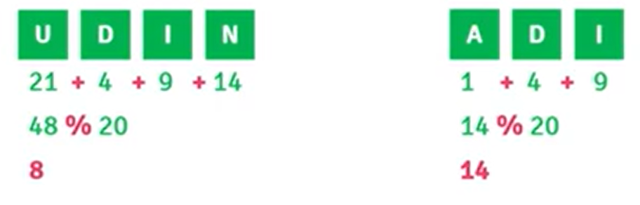
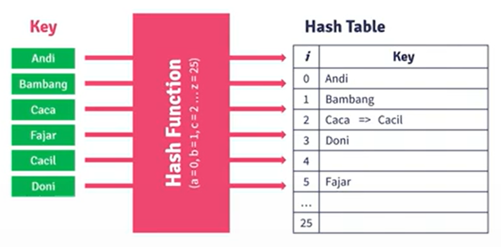
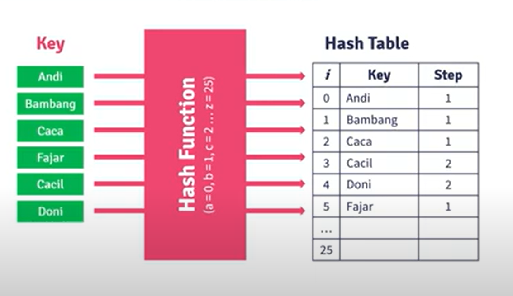
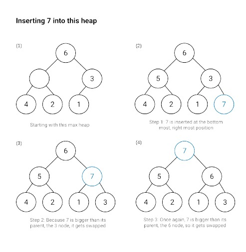
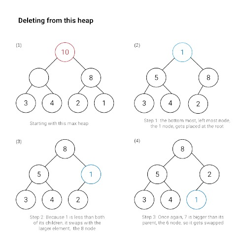

# Collection Data Structures

## Lists and sets in different programming languages
### Mutability
The concept of immutability has already been discussed. Concretely, it is how a data structure is created. Immutable objects cannot be changed when created, while mutable ones can be changed after creation. Sets are an example of an immutable structure in most programming languages. However, objects that are added to sets can be treated differently depending on the language. In JavaScript, you can add mutable objects to a set, which is not permitted in Python. Understanding this fundamental difference will give you insights into how the language uses sets.

### Why are sets as quick as they are?
The reason for the speed at which sets can find an item is down to their underlying architecture. Sets store values using a hashing approach. To hash something is to take it and generate a unique output from it. This is done by applying an algorithm to it that converts the input into a simple alpha-numeric (words and letters) output. Every time the algorithm sees the input, it will always generate the same alpha-numeric output. This is then used in a hashtable, which uses the unique hash to inform where to store an item in memory. A hash table allows accessing elements in constant time (O(1)) regardless of the size of the set. So, it is possible to know with one computation whether the value is in memory or not. Instead of searching for every element in the list, just apply the hashing function and check if it is being used.

Therefore, sets are fast but the reason they're so fast is also why you can't change the value being stored. If you create a hash for an element and store it according to that hash, then you change the item, and the hash will no longer be able to find it. This is one reason why Python only allows you to store immutable objects that can't be changed in sets. Not all languages offer this protection. For example, JavaScript does allow the storing of mutable objects. Thus the object's protection is left to the user when coding with JavaScript sets. Suppose you wish to alter a mutable value in JavaScript. In that case, extracting and deleting the mutable object is advisable before reinserting it into the set as a new element.

### Lists
Another important collection type that is good to know about is lists. Lists store elements in a given order which can be accessed using an index. An index is just a number passed to the list that indicates that the element found at that number location should be returned. The index is how elements are searched in a list. If someone wants to know if something is in a list, they would have to do a search and check each item, so they are slower than a set. Additionally, a list will allow you to store all kinds of elements in them. There is no distinction made between whether an item is mutable or immutable. Lists will also allow you to store duplicates of items. There are different types of lists that are implemented differently. 

However, the fundamental point that is worth remembering is that a list allows you to store repeating items and items of different types. A list is ordered, which means that it will retain the ordering of items as they are inserted. This is different from sets, which might store items in different locations from where they were initially entered.

Knowing these subtle differences can be helpful when deciding what type of data structure you want to select. Both sets and lists are useful, but because they act differently, they will be more useful in some situations than others. Making sure that a list or a set is most suitable in a situation is the trick!

## Stacks and queues in different programming languages
### Stacks
Stacks are an example of an abstract data type. In computer science, this means that there are some very important characteristics that need to be enforced when implementing it, but there are no actual built-in versions that you can just import. For stacks, the important principle is LIFO or last-in-first-out. The analogy for stacks can be to visualize a pile of plates on a washing board. As each plate is cleaned, it is placed on top of the previous one. For drying them, each plate must be taken from the top. So, the last plate added to the pile is dried first, and the first plate on the pile is dried last. A common usage for stacks is to keep your browser history. Each time you hit back, the previously visited page loads and, going forward, then reads it to the pile.

A common implementation of a stack in JavaScript is through using an array and making sure that it acts only in a way that a stack would act. Taking a data structure and using it to build another type of data structure is said to use a container adapter. So here, the array is the container, and the adaptation forces it to behave as a stack should. The important features of a stack are push, pop, peek and count. Push adds an item to the top of the stack. Using an array means that the count must always know where on the array the last item went. Equally, for the pop method, having a count for the array is important, as pop only returns the last item entered on the stack.

### Queues
A queue, like a stack, is a linear data structure that retains the order in which things were entered. When one talks about a linear structure, it means that items are stored in the order in which they were added. Just like a stack, the queue has a strict implementation of how items are added and removed. While a stack implements a LIFO approach, queues work with a first-in-first-out (FIFO) approach. So, the first item that is added to the queue will be the first item that is removed. Like a customer queuing to make a purchase, queues look to implement a policy that places importance on the time of arrival. This has some real-world benefits when implementing things like CPU and disk scheduling, where it is important to deal with tasks as they arrive.

A queue is an abstract data type in Swift, which means that to use the functionality of a queue, you would first have to code up a structure that will act in that way. Two important terms associated with queues are enqueued (to add an item to the queue) and dequeue (to remove an item from the back of a list). The simplest approach for creating a queue is to use an array as the container adaptor. Because a queue only pops elements from the front of the queue, the look-up time will always be O(1), so any application built using this approach can expect very quick service. As with stacks, the available methods for a queue are kept minimal, with peak, pop, push and size being the most important ones.

Python implements several variant queue classes that are all synchronized. Synchronization is a computer science concept that means that all access to the data found there is managed so that the data structure can only be accessed by one process at a time. This is important when you think about cloud computing and having many different sources trying to look up and change data at the same time. On top of FIFO and LIFO, Python queue implementation includes a priority queue. A priority queue, as the name suggests, is about assigning importance to the elements found in the queue. So instead of a first-come-first-serve basis, service is based on importance. This is a bit like the VIP line at the concert.

## Trees in different programming languages
A tree is an abstract data type (ADT) that is present in many languages. As discussed in other readings, an ADT is a blueprint for how a data structure will manifest. It relates to the restraints and requirements placed on a data structure to ensure that it will always operate in the same way. This can be very useful for programmers who are switching between multiple programming languages as it provides clear expectations of how a data structure will operate. 

The key fundamental principles of a tree are that it contains a number of nodes, a root node and a selection of leaf nodes. Leaf nodes are unconnected nodes at the base of a tree. A root node is always at the top, and every value descends from this one node. A tree will always be arranged in some form of hierarchy. 

There are many types of trees; perhaps the most straightforward and common one is a binary tree. A binary tree has the following properties: 
1. Every node has a maximum of two child nodes.
2. Every node must have a key so that it can be easily identified.
3. Values found to be less than the node are placed in the left child node, and values that are greater are placed in the right child node.

To create a tree, one must ensure that there is a root (starting node) and a method for determining the subsequent nodes. Each node must contain a reference to the left and right nodes so that the tree can be traversed. This can be achieved by creating a class with these three attributes (key, location of left node, location of right node). This class will need three additional methods so that it can function as a tree. These include: 
1. A lookup method: It is important that the tree can be queried for the existence or absence of information. 
2. Insertion method: As has already been noted, inserting a node on a tree involves finding out where it should go and placing it on the left side of the nearest higher value. 
3. Removal method: This method will need to remove an item from a tree. This operation poses additional challenges when applied to a tree due to the connected nature of a tree. Consider that a tree comprises a series of connected nodes. So, removing one carelessly can result in destroying the connections in a tree. Therefore, when implementing this method, in addition to removing the node, it is necessary to check all the children nodes and ensure that a new connection is made with the node of the next highest value. 

### Searching in trees
The approach outlined above for coding a tree is applicable to all the languages covered in this course. There are no concrete implementations of trees, which means that to use them, you are required to implement the code yourself. Another feature that is worth bearing in mind is how a search is performed on a tree. One can code a solution that applies a `depth-first search` or a `breadth-first search`. To better understand this concept, consider how the tree is organized. Each level has a parent node that connects to two child nodes. These child nodes, in turn, have two of their own child nodes:
- A breadth-first search is one that will examine each node on the same level before stepping into a deeper level. This can be pictured as scanning all nodes horizontally before checking the next level.
- A depth-first search will examine each node on a branch until the end node is reached before checking the adjacent branch. This can be pictured as a vertical scanning of the tree. 

# Advanced Data Structures

## Hash Tables
`What is a hashtable?`

A hashtable offers very quick lookups for an application. This is achieved by creating a hashing function that will create an alpha-numeric (letters and numbers) output(hash key) from a given input. This hash is then used to determine where in memory to store something. This means that when you want to know if an element is in the data structure, instead of looking through every item and making a comparison, you only need to apply the hashing function and see if that item has been hashed to memory. When you consider that a data source might have millions of entries, not having to check every single one is a great time saver. 

`hash Funcion Method`
There are many ways to hash a string into a hash key:
- Mid-Square
- Division
- etc

`Mid-Square`
Step:
1. raise the key power and take the middle bits of the power results to be used as a hash key
2. Represent the character to be a number (a-z) --> (1-26)
3. if the key is a string then change it to a number
Example:

`Division`
step:
1. Do the division on the key with the modulus operator (according to the number of hash tables)
2. Represent the character to be a number (a-z) --> (1-26)
3. if the key is a string then change it to a number
Example:

`Collisions`
Collision in hash tables occurs when two or more keys are hashed to the same location in the hash table. In a hash table, a key is used to access an associated value. When a collision occurs, it means that two or more keys need to be stored at the same location in the hash table, which can cause conflicts in accessing the associated value.

There are several techniques that can be used to handle collisions in a hash table, such as:
1. Chaining: each hash table slot is filled with a linked list, so if there is a collision, the key can be inserted into the appropriate linked list.

2. Open addressing: attempts to place the key in a different hash location if a collision occurs, such as linear probing, quadratic probing, or double hashing.

## Heaps and graphs in different programming languages
`Terminology`
Graphs are comprised of nodes and edges. The node is where the data is stored, and the edge is a connection between two nodes. Unlike a tree, nodes do not have to be connected and can exist independently from the other nodes. An edge connects two nodes. An edge can be said to have a weight. This is a value that is stored in the connection that infers some information on the strength of the connection between the two nodes. A graph can be said to be directed, this means that the edges are focused (like a one-way street) or undirected (like a two-way street) and the connection infers information back and forth.

`Heaps`
Heaps are implemented differently in different languages but are essentially graphs with specific constraints. Heaps sort information in order so that they can quickly return min and max values. Thus, they employ a binary approach, and any implementation must have a maximum of two nodes. Depending on the implementation, a heap will have the largest or smallest value as the root. Finally, each branch of the heap will follow a sequential pattern. 

A heap has an O(1) lookup time because it only returns one item. The highest or lowest value depends on whether it is a min or max heap. This means that once this value is popped, the following item is pushed onto the root node of the heap. This also impacts inserting onto a heap. When a new element is added, beginning at the root, it is compared to each node until the correct position is determined. The surrounding elements are then moved to ensure that it is placed in the appropriate position.
Exmaple of Max Heap (Inserted and removal item)
#### Inserted Item

#### Removal Item
