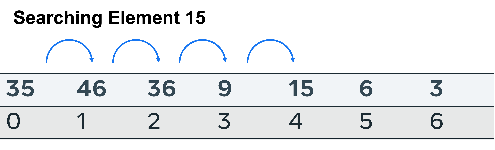
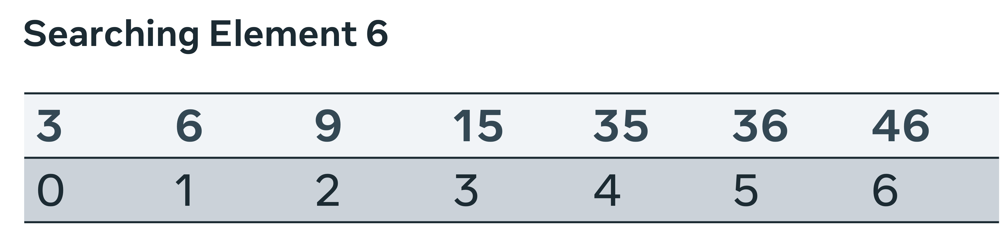
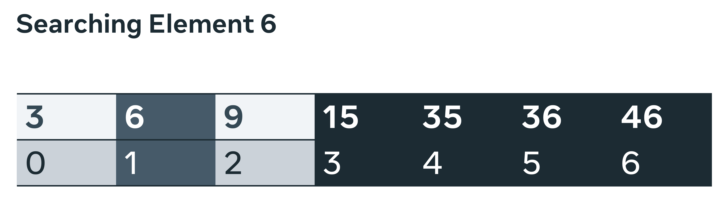

# Sorting And Searching
## Selection Sort
[](https://www.youtube.com/watch?v=g-PGLbMth_g)
<br>
Selection sort is a sorting algorithm that works from a very simple principle. Take an array to items and iterate from left to right. Starting with the first place on the index, iterate over the entire array and swap this value with the lowest value found to the right of this item. Repeat until the entire array is sorted. 
Selection Sort has:
- Worst case time complexity is O(N^2)
- Average case time complexity is O(N^2)
- Best case time complexity is O(N^2)
- Space complexity: O(1) Auxiliary

To perform selection sort, take the following steps:
1. Find the smallest value and swap it with the first value of the array 
2. Find the second smallest value and swap it with the second place in the array 
3. Repeat until all items are changed from ordered from smallest to largest

Time complexity is determined in relation to the number of transactions enacted. Given a list of size n, the compiler must search each entry in the list to identify the smallest item, then perform a swap to index location 0. The pseudocode for the algorithm is as below.
```
for(i = 0; i < n-1; i++)
int min_index=List[i]
    for(j=i+1; j<n;j++)
        if(List[j] < List[min_index])
            min_index=j 
    swap(List[i], List[min_index])
```
 Line 1 says that the length of the list List must be searched n-1 times. Line 2 sets a temporary variable to hold the lowest value. Line 3 is an inner loop that must iterate through the loop n-1 times. Line 4 checks if the value found in position List[j] is smaller than the current lowest value. If so, the position of that element is recorded. At the end of each inner loop, the value found to be the lowest is swapped with position i in the index, i is incremented and the procedure begins again. Always check the next item in the list until every item has been checked. 

There are four considerations to be made when evaluating this algorithm.
1. Worst case scenario: Given a list sorted in reverse order, how many comparisons are made? The inner and outer loop will have to run n times so it can be determined that worst case = O(n^2).
2. Average comparison: Regardless of the order of the list, every item must be checked against average case = O(n^2). 
3. Best comparison: Given a sorted list of how many comparisons must be made. Again, regardless of the items in the list, every item must be checked, so best case = O(n^2).
4. Finally, what is the space complexity of this approach? Because an in-place swap is being performed, no temporary array is required. There are three temporary variables i, j and min_index; however, these are not dependent on the list size. So, the image doubles the list, and the space complexity does not increase accordingly. Therefore, space complexity = O(1). 

## Quicksort
[](https://www.youtube.com/watch?v=qlXDoaZ2FqI)
<br>
Quicksort is a sorting approach that uses a divide-and-conquer methodology. Given an array of items, a place is determined on the array on which to split the array and this is called the pivot point. All values greater than this point go to the right and all values less than this point go to the left. In this step, you have two arrays. The same process is applied to these arrays until there are no elements left to sort. 

Quicksort has:  
- Worst case time complexity O(n^2)
- Average case time complexity O(n log n)
- Best case time complexity O(n log n) 
- Space complexity O(n)

To perform quicksort, take the following steps: 
1. Select a point on the list to pivot on. 
2. Split the list into two lists, items to the left of the pivot and items to the right. 
3. Set variables i to iterate from left to right on the left of the pivot. Set variable j to repeat from right to left on the left side of the pivot.
4. The variables i on the left look for a value greater than or equal to the pivot. Variables j on the right look for a value less than or equal to the pivot.  
5. When j < i, the values at these index locations are swapped, this is repeated until i and j meet at the pivot point. 
6. Partition the list values into two lists, one to the left and one to the right of the pivot. Repeat the process on each of the resulting arrays. 
7. Recursively apply the algorithm. 

The pseudocode below for quicksort is done recursively.
- Starting at the leftmost element, each subsequent element is checked, and if it is found to be less, it is swapped. 
- Line 3 calls the partition method, which begins on line 8. 
- Line 10 determines the more significant element to be placed on the right side of the list. Line 10 sets a variable i to be assigned to the index of the smaller element. The variable j is then used to check the elements to the right from which to make a comparison with the current smallest element. 
- Line 12 determines if there is to be a swap, a smaller element on the right will require moving to the current index position.
- Line 4 is for sorting the left array. 
- Line 5 is for sorting the right array. At each iteration, the size of the array to be sorted is halved. The arrays will continually break down until only one element is left in the subarrays. The result of calling partition will determine the location of the current element. This location is incremented and repeated until every element rests in its naturally ordered position.      
```
QuickSort(List, low, high)
        if(low<high) 
	pivot=partition(List, high, low)
	QuickSort(List, how, pivot-1)
	QuickSort(List, pivot+1, high) 

Partition(List,high,low)
        pivot=arr[high]
        i=(low-1)
        for (j = low; j <= high-1; j++) 
	if(List[j] < pivot)
	        i++
	        swap(List[i], List[j]) 
        swap(arr[i+1], List[j]) 
        return I + 1 
```

Things to consider when evaluating this algorithm: 
- Worst case scenario: this happens when the most significant element is consistently chosen as a pivot point. This will cause a loop to iterate over every element n from the left. The split will cause a search of every element on the right with none on the left, O(n^2). 
- Average case scenario: an average pivot point is selected at every call. This will reduce the number of additional iterations required. So, there will be n iterations and an ever-decreasing logn iterative calls, O(n*logn). 
- Best case scenario: The middle value is always selected, and the iteration space is halved at every iteration, O(n*logn).
- The iterative nature of the algorithm will impact the space complexity because the function call and variables are retained on the stack while the calculations are performed. However, the decision to use an in-place swap means no new array needs to be created, O(log n).

## Linear Search
A linear search is the most direct way of retrieving an item. It means that the search starts at the first item and iterates until either the target item is found or there are no more items left in the array to check. 

Given a list of numbers, start at index location 0 and compare each item with a target variable. Return when the index location has been determined or the entire list has been checked and there is no instance of the target element.



These are the outcomes to consider when evaluating the efficacy of the search. 
- Worst case: The item is absent from the list. To determine this, every possible location in the list size n has to be searched. O(n) time complexity.
- Average case: The element is found in the middle. This is considered an outcome of O(n).
- Best case: The item is found at the starting index and no further checks are required, so O(1).
- Space complexity: No additional space is required to perform the search. So, the space required will only be as large as the items that have to be stored in the list, space complexity O(n).

## Binary Search
A binary search is performed by first identifying the mid-point on a sorted list, comparing the target element to it and discarding the half that is less than the target element. This halving at the mid-point is repeated until the target element is found or there is no more list to half. 

To conduct a binary search, the list must first be sorted.



First, a middle point is selected. The value at index 3, is 15. Is this greater than or less than the target element? The search space is broken in two and the left is further examined. 


A new central point is selected. This time there are only three slots to check; index location 1 is at the halfway point. 




The target value is found here and no further splits are required. 

These are the outcomes to consider when evaluating the efficacy of the search: 
- Worst case: The item is absent from the list. Due to the nature of the approach, many items are removed with the use of the logical operators greater than and less than. This means that only n/2 is checked first, then n/4 and n/8. The overall complexity is then O(log N).  
- Average case: The element is found after several iterations. Again due to the search mechanism, each subsequent call reduces the state space. So, it can be determined that after a medium number of searches, the complexity is O(Log N). 
- Best case: The item is found at the starting index and no further checks are required, so O(1).
- Space complexity: No additional space is required to perform the search. So, the space required will only be as large as the items to be stored in the list, space complexity O(n).